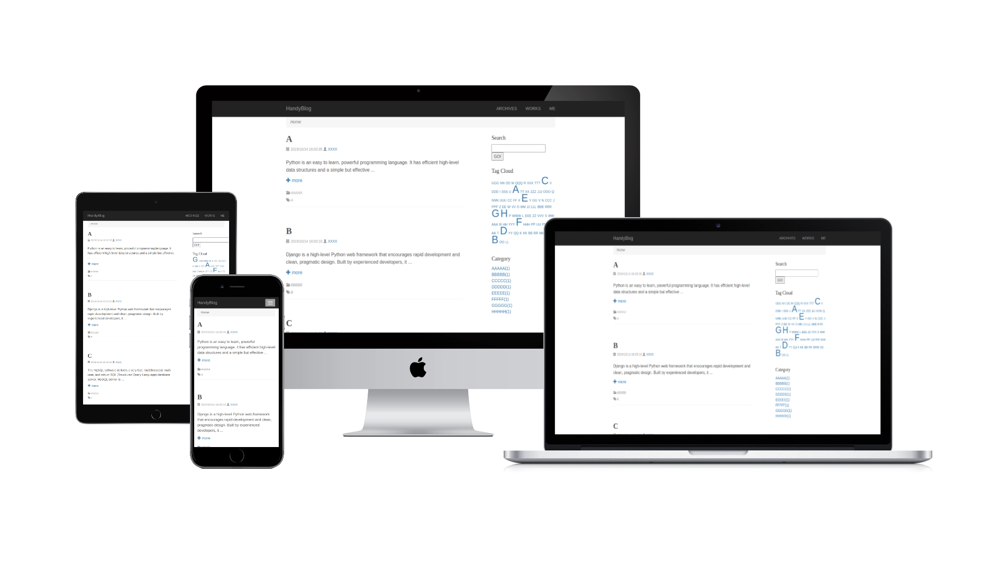
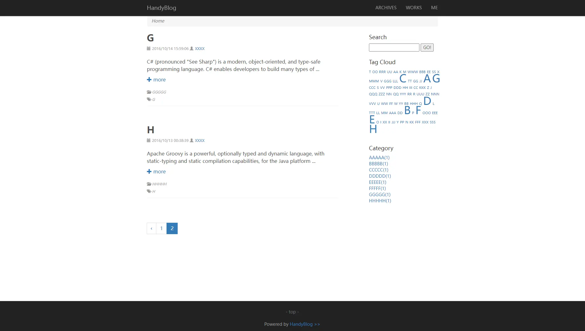
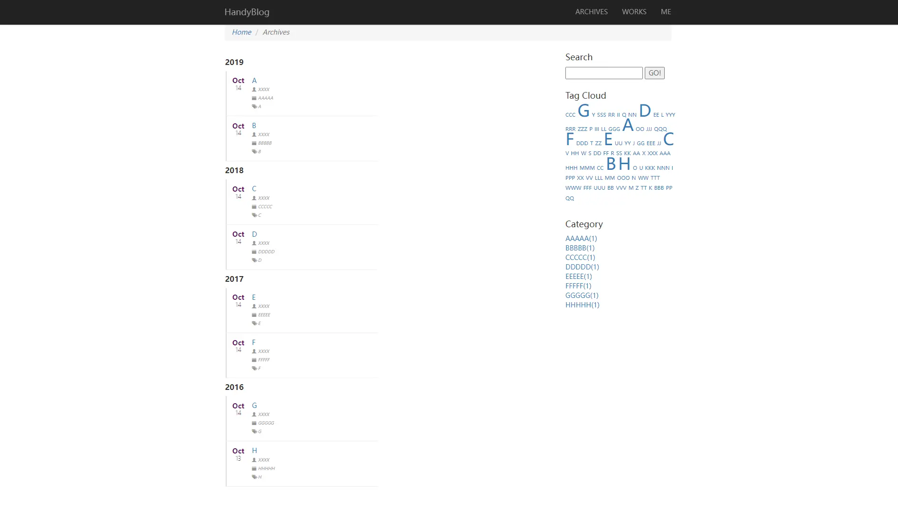
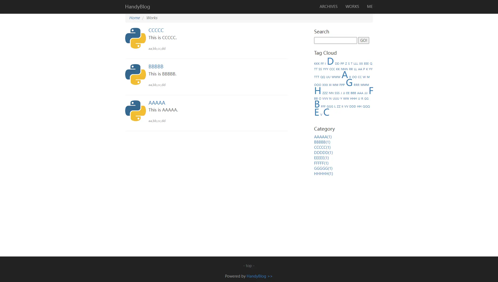
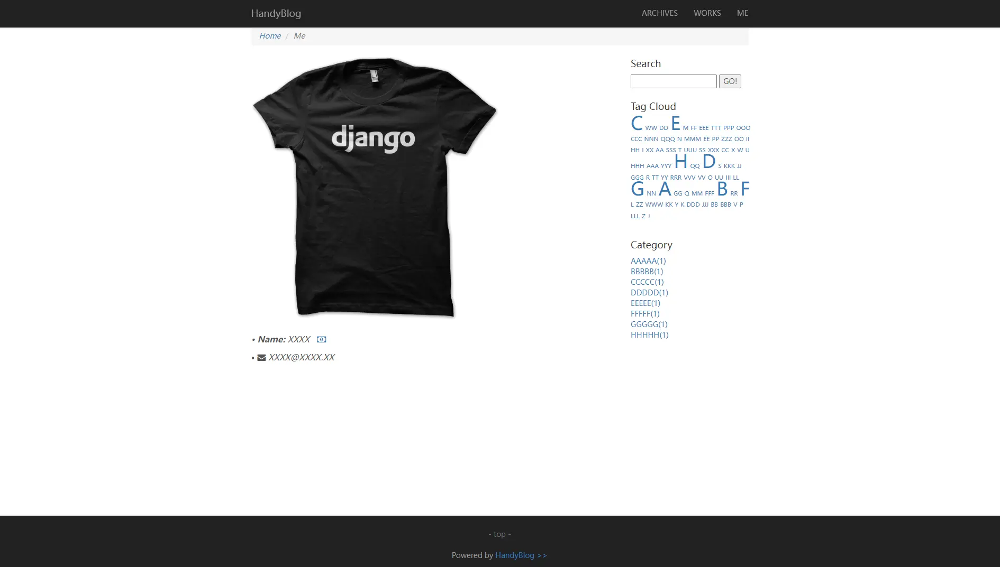
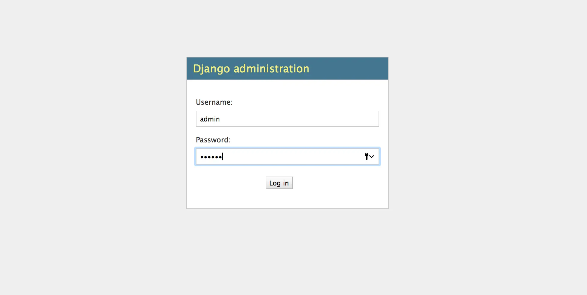
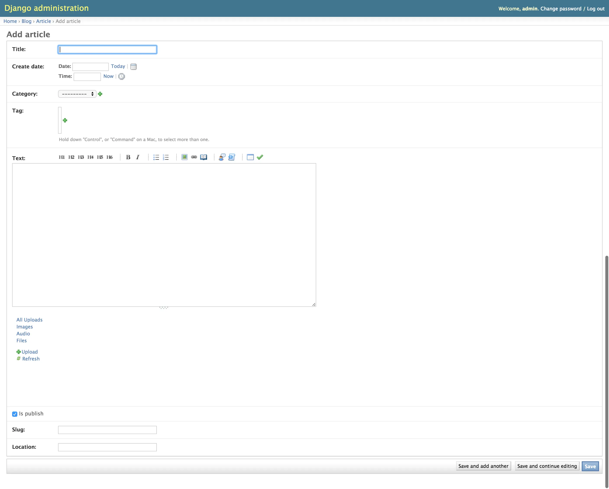

# HandyBlog

**HandyBlog** is a blog base on Python + Django .   
In a few minutes you'll be set up with a minimal, responsive blog like the one below !  
  
  
  
  
  

## Quick Start

### Step 1) Clone repository

```
git clone https://github.com/byname4321/HandyBlog.git
```

### Step 2) Environmental preparations

The environment should be 'Python2.7(devel) + Django1.7.1 + MySQL'.  

Install Python development version :        

```
apt-get install python-dev    
```

Install MySQL :  

```
apt-get install mysql-server  
```

Install Python interface to MySQL :  

```
apt-get install python-mysqldb  
```

Install Django :    

```
sudo pip install django==1.7.1
```

Auto install other requirements : 

```
python install_requirements.py   
```

*(The location of the file 'install_requirements.py' is [HandyBlog/install_requirements.py](./install_requirements.py))*

If the 'pip' is not installed in your environment, follow the steps below to complete the installation :  

```
curl https://bootstrap.pypa.io/ez_setup.py -o - | python  
```

```
easy_install pip  
```

### Step 3) Config Database

Edit [xblog/settings_dev.py](xblog/settings_dev.py) to config database info.

Example :   

```
DATABASES['default']['NAME'] = 'xblog'
DATABASES['default']['USER'] = 'root'
DATABASES['default']['PASSWORD'] = '123456'
DATABASES['default']['HOST'] = '127.0.0.1'
DATABASES['default']['PORT'] = '3306'
```

You should create a database named 'xblog' in MySQL : 

```
mysql> create database xblog;  
```

Finally, make models into your database schema : 

```
python manage.py makemigrations  
```

```
python manage.py migrate  
```

### Step 4) Run !

```
python manage.py runserver 0.0.0.0:8080  
```

or nonhup  

```
nohup python manage.py runserver 0.0.0.0:8080&
```

Now you can try http://127.0.0.1:8080 . 

### Step 5) Publish your first blog post

Create an admin account for first start : 

```
python manage.py createsuperuser  
```

For example, set username 'admin' and password '123456'.

Then access http://127.0.0.1:8080/admin, type the username and password to login : 



## Questions?

[Open an Issue](https://github.com/byname4321/HandyBlog/issues) and let's chat! 
